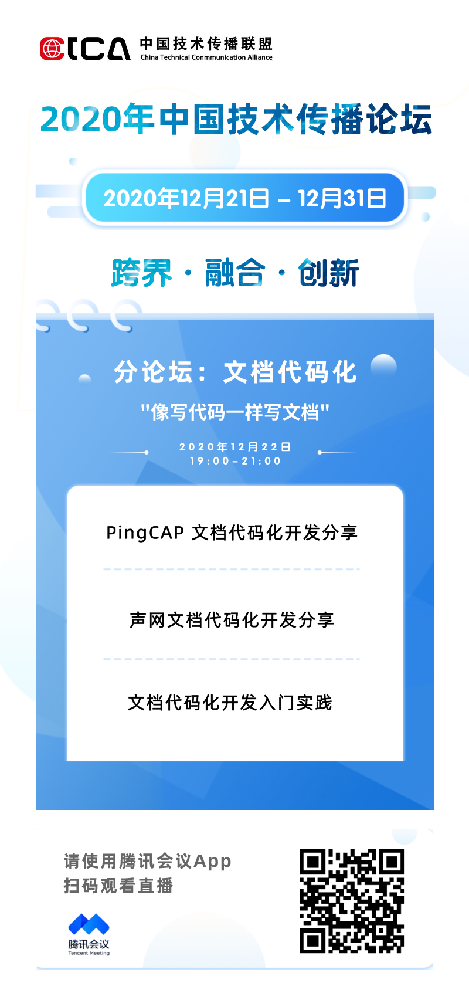

==================================
分论坛：文档代码化
==================================

``>>> 像写代码一样写文档!``

----

2020年12月22日 19:00-21:00

直播地址：https://meeting.tencent.com/live/16441993180963614203

   |直播流将于2020年12月22日18:50开始，19:00正式直播。提早进入会看到“直播已结束”几个文字，可以直接忽略，等候直播开始。

----

演讲内容：
=======================

PingCAP 文档代码化开发分享
--------------------------------

演讲人：易可可
   PingCAP 公司 Tech Writer，熟悉文档代码化领域的多版本/语言文档管理、风格检查自动化、翻译社区建设等工作。

----

声网文档代码化开发分享
----------------------------------

演讲人：曹颖
   目前就职于 Agora 声网，在团队负责整个文档中心的架构设计、以及部分产品文档的创建和维护。

内容简介：声网的 RTC SDK 支持安卓、iOS、Windows 等八大主流平台，C++、Java 等多种编程语言。文档团队需要为所有平台及语言提供相应的 API 文档。随着公司代码量的增加，传统的手写模式越来越难以为继，而同步更新、持续交付的挑战日趋严峻。 一年前，我们的团队正式告别手写模式，采用业内流行的 Docs as code 方式，将 API 注释迁移到代码中，并集中选取了一批文档自动生成工具，生成匹配各平台风格的 API 文档。该演讲会重点介绍 Docs as code 的几大优点、如何选择合适的文档生成工具、艰辛的迁移过程、以及对初创企业来说，如何在设计文档中心之初打好基础，免于频繁切换工具之苦。

----

文档代码化开发实践（Tutorial)
----------------------------------------

演讲人：杨正宇
   北京大学软件与微电子学院研究生

内容简介：本部为入门教程，本讲座将分享如何使用sphinx进行文档代码化的开发实践。

----

请 点击此处_ 注册会议，方便收到后续其他分论坛的参会方式。  

.. _点击此处: http://pkutc-training.mikecrm.com/R05q1J9