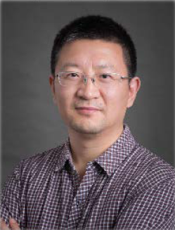
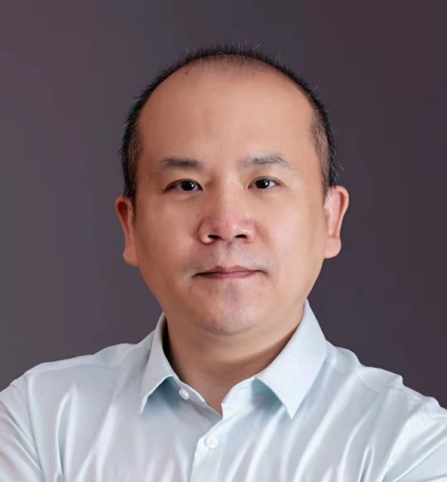
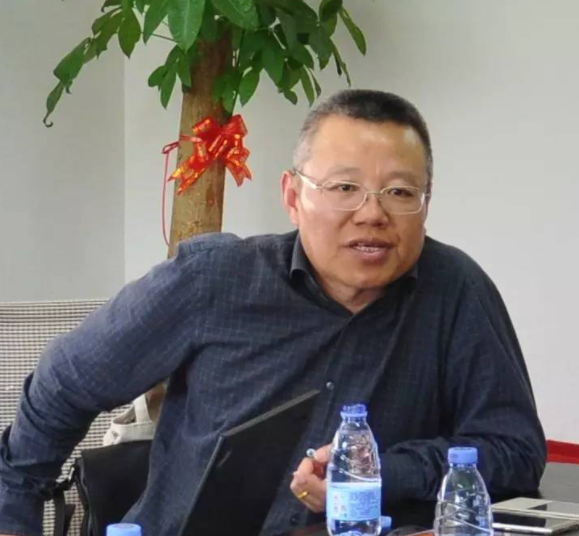

====================================
分论坛：技术翻译与技术写作
====================================

2020年12月28日 13:00-16:00

直播地址：https://meeting.tencent.com/l/RsS3vyo1WeKC 

    1. 直播流将于2020年12月28日12:50开始，13:00正式直播。提早进入可能会看到 **“直播已结束”** 几个文字，可以直接忽略，等候直播开始。
    2. 因为腾讯会议直播的缺陷，切换演讲人时会卡顿住，刷新后即可正常观看。

####

演讲内容
============================

技术翻译与技术翻译教学
----------------------------

张霄军（西交利物浦大学）

    西交利物浦大学翻译系助理教授、博士生导师，英国利物浦大学荣誉讲师，世界翻译教育联盟翻译技术教学研究会副会长。

####

翻译技术在技术翻译中的应用
--------------------------

郭庆（东南大学）

    东南大学外国语学院MTI教育中心主任，从事口笔译教学与实践20余年。中国技术传播联盟副理事长、江苏省科技翻译工作者协会常务理事、江苏省翻译协会理事和副秘书长、南京翻译家协会常务理事和专委会主任。

####

技术文档翻译与写作
---------------------

张建农

    Mr. Francois Zhang （张建农）was the Chief Engineer and Principal Translator, Director of the 2012 Labs, and Senior Manager of Huawei Translation Service Centre, Nanjing Division of Huawei Technologies. He is the MTI Tutor for Nanjing University, Southeast University, and other 4 universities in China. His research interests cover GILT and management. His selected publications include The Huawei Manual of Style, The Guideline for GUI English, and The Guideline for Terminology Management. 

